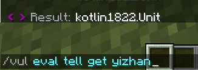

# 数据相关

## 数据类型

<details>
  <summary>点击展开</summary>

不会讲

</details>

### 类型转换（Type）

> https://kether.tabooproject.org/list.html#Type

```
type {token} | type {type} {action}
```


### 自动类型转换

TODO

## 变量（Variable）

在这里想一个非常巧妙的比喻

思考ing...

## kether

此处讲解 kether 自己的变量，此变量特点是 kether 环境摧毁就消失

比如：TrMenu 关闭菜单，Vulpecula 的命令执行完成

### 基础

#### 设置

> https://kether.tabooproject.org/list.html#Variable_Set
```
set {token} {token} | set {token} to {action}
```

注意上面的语法，前者只能输入固定内容，后者可以把动作的返回值传入变量


接着我们获取下这个变量

#### 获取

> https://kether.tabooproject.org/list.html#Variable_Get

```
get {token} | &{token}
```



啪！空的！

我擦嘞，这是咋回事？

还记得我说过的吗

> 此变量特点是 kether 环境摧毁就消失

是的，当你执行完 `/vul eval set yizhan to 114514` 之后，kether环境已经被摧毁了，所以这个变量就消失了

正确做法：

```
/vul eval set yizhan to 114514 tell get yizhan
```


成功得到了变量里的内容！

对于获取变量，我们有个更简单的办法 `&{token}`


看到这里，你就应该知道，为什么前面讲 [彩色（color Text）](basic.md#彩色color-text) 动作的时候会说

> 这里要用 `" "` 把要打印的信息包裹起来
> 否则他会把这个当成变量，具体的会在后面讲到

### array

## TrMenu

## Invero

## Chemdah

## Vulpecula

## 案例

### 每日刷新

TODO
