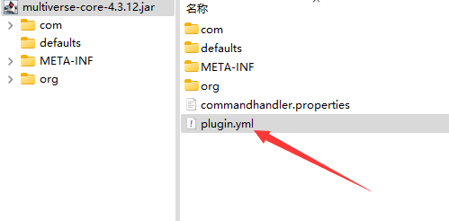

# plugin.yml

用解压缩软件打开插件的jar文件就可以看到 `plugin.yml`



用文本编辑器可以打开它


其实只有 `name` 和 `main` 是必填的，其他可写可不写

比如一个插件有提供命令，但它不在 `plugin.yml` 中写 `commands` 也是很常见的

但是你的插件如果只有这两个……

你在用啥邪门小插件

## 常见的键

:::tip

其实这里面写什么都可以，但多数就那么几样

下面是常见的一些键值

:::

## `name`

插件的名字，也是会在插件列表（`/pl`）和日志中输出的信息中显示的插件名

## `main`

插件主类，加载插件时运行的类的名称，类似正常程序中的 main 函数，服主不用管

## `authors`

插件作者，显示在 `/version 插件名` 中

## `website`

插件相关的网站，显示在 `/version 插件名` 中

## `softdepend`

软依赖，即不必须装的依赖

## `depend`

硬依赖，必须安装

## `api-version`

插件编译时使用的 API 版本，影响着 Bukkit API 对插件提供的兼容性

## `version`

插件版本，显示在 `/version 插件名` 中

## `commands`

插件提供的命令

## `permissions`

插件权限相关

## `folia-supported`

当此项为 `true` 时，Folia 端才会尝试加载此插件

如果插件的 `plugin.yml` 里没有此项，你可以试着手动添加

```
folia-supported: true
```

:::danger

Folia端对 Bukkit API 的修改是破坏性的，你手动添加而不是插件开发者去兼容，通常加载了也是不可用的

这就是为什么要开启此项 Folia 端才会加载插件

:::
