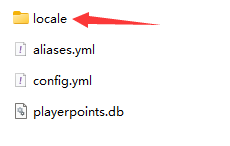

# 概览

## 如何安装插件?

将插件的jar文件放入服务端的 `plugins` 文件夹

## 如何寻找插件?

TODO

## 如何查看插件支持的语言?

spigotmc

目录下有文件夹

插件文件夹中有Language,lang之类的文件夹(或其他东西?)

找 zhcn,zh-cn,zh-CN,chinese 等字眼

## 如何汉化插件?

以下是你可能遇到的情况

插件自己动♂

像luckperms,essentials,你机器的语言设置成简体中文即可

配置文件改语言

像HoloMobHealth,Gsit,你可以在插件配置文件中(一般在config.yml中)找到Language,lang等字眼

然后把把后面改成 zhcn,zh-cn,zh-CN,chinese 啥的,具体应该写什么这地方的注释可能提到,没提到那得靠你自己寻找了

自行汉化

有些插件不提供别的语言,只提供一个语言文件 如 lang.yml,message.yml

就需要你自行汉化里面的内容了,去一些论坛翻翻也许能找到别人分享的汉化

内核汉化

如果你要用的这个插件没有以上所提到的所有情况...

他**可能**把你要改的语言直接写死在代码里了,你要自己去改代码

