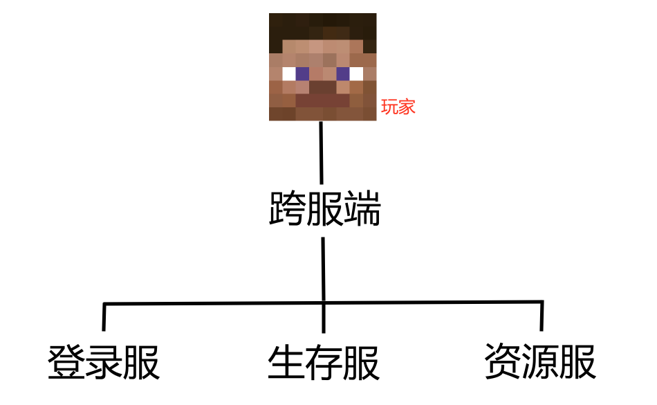

# 什么是跨服端?

简单的来说就是将多个服务器连成一个整体（比如你经常看到的某些生存一区，生存二区），玩家可以自由选择到哪个服务器，而不用退出重连，

不同服务器之间可以通过跨服同步（比如HuskSync）和数据库同步数据，平时常听到的群组服也是一个意思. 跨服通常的实现方法是:

一个反向代理端（如Velocity/BungeeCord）和多个子服务器（如Paper/Purpur/Leaf等）. 玩家只需要连接到反向代理端即可让反向代理端和子服务器联系，最后把玩家送到对应的服务器.

# 原理讲解

假设你现在有三个服务器，分别为 登录服，生存服和资源服，三个服务器都能正常进入和游玩

现在你想建设一个群组服把这三个服务器连接起来，那么，你的服务器结构就会是这样

:::info

BungeeCord/Velocity端（或他们的Fork）在这里我们称为`跨服端`（或者称为上游服务器）

这三个服务器都称为 `子服` 图中为三个子服，子服没有先后之分（或者称为下游服务器）

:::

> 如果你的群组服搭建完成，那么正常流程是:
>
>> 玩家通过客户端连接到跨服端，接着由跨服端送至各个子服，玩家可以通过一些方式切换自己所在的子服，感觉上就像是切换维度，玩家甚至意识不到自己换过服

# 为什么需要代理端?

1. Minecraft 是个单核心游戏，玩家数量在超过50-100后几乎任何核心都无法保证完全流畅(Folia 除外)，而使用多个服务器则可以充分利用多核心优势，大服务器必备;

2. 对多个服务器，玩家需要退出重新进入，且数据不能共享. 仅仅只是开两个服务器无法产生有效交互. 所以需要跨服端对服务器进行切换和交互的完善;

3. 对单个服务器，在内存有一点点富裕的情况下(通常不到1GB)，仍推荐使用代理端，服务端对于反假人攻击的性能不如代理端，如果你被攻击了，更换成代理端再说;

4. 有些插件是代理端才能安装的，而在 Bukkit 系下可能不稳定(如[MultiLogin](https://github.com/CaaMoe/MultiLogin)).

# 推荐用什么?

推荐使用Velocity

## 安装数据库

你都跨服了，估计会有多端数据同步的需求吧?

看 [数据库相关](/docs/扩展阅读/数据库相关.md)

一般需要安装两个数据库，MySQL和Redis，MySQL 用于存储重要信息，比如账号密码，经济，权限 Redis 用于快速跨服同步
